# 国补订单审核完整链路流程图

> 版本快照：2026-07-19。本文以当前仓库代码为准，只描述现状，不修改任何业务代码或提示词。

## 0. 阅读说明

本文把系统分为四层：

1. **采集层**：从已登录 Edge 页面取得筛选后的订单和全部审核图片。
2. **批次层**：锁定模型、提示词、运行环境和任务集合，组织首轮、网络失败重跑及报表合并。
3. **单单审核层**：本地预检、SN 识别与精确比对、分品类图片合规、逐图真实性裁决。
4. **结果层**：形成逐单结果、审计轨迹、Token/耗时统计和 Excel 汇总。

图例：

| 标记 | 含义 |
|---|---|
| 生产主链 | `run_guobu_audit_batch.ps1` 默认 `hybrid` 模式实际执行的路径 |
| 本地裁决 | Python/PowerShell 确定性规则，优先于模型自由文本 |
| 模型观察 | 模型负责识别或结构化观察，不直接决定所有最终结果 |
| 可选插件 | 必须显式开启，或可由环境变量关闭/切换 |
| 兼容路径 | 文件或模式仍保留，但不是当前默认生产链 |
| 失败关闭 | 无法判断、结构异常、服务异常或超时均不自动放行，转人工 |

## 1. 全系统总览

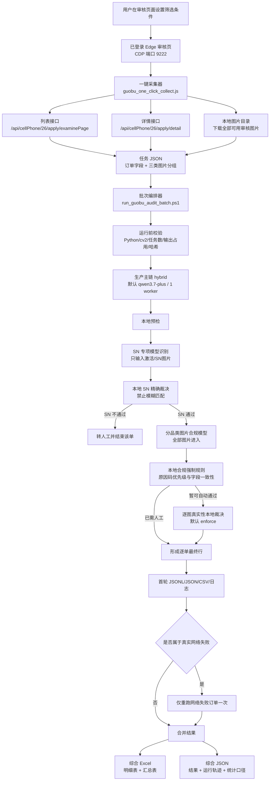

### 当前生产默认值

| 项目 | 当前默认 | 业务含义 |
|---|---|---|
| 模型 | `qwen3.7-plus` | 批次脚本默认模型 |
| 审核模式 | `hybrid` | SN 与图片合规分阶段执行 |
| 并发 | `Workers=1` | 单 worker，避免并发放大网络超时 |
| 深度思考 | 关闭 | Qwen 3.x 请求自动带 `enable_thinking=false` |
| 每单总期限 | 60 秒 | SN、复核、合规、真实性共享同一总预算 |
| 模型请求间隔 | 3 秒 | 全局请求锁控制最小间隔 |
| SN 字符插件 | `off` | 可选 `on` 或 `v2`，只改善读字，不改变精确比较 |
| 定向 SN 复核 | 关闭 | 批次脚本默认传入 `--no-targeted-sn-review` |
| 普通 3C 激活证据插件 | `on` | 手机/平板/手表按逐张结构化证据裁决 |
| SN 标签真实性插件 | `off` | 显式开启后增加本地图像纹理检查 |
| 图片真实性 | `enforce` | 命中真实性风险或服务异常会转人工 |
| FFT 补充模型 | 关闭 | 仅环境变量显式开启；只能从无证据升级到人工复核 |
| 网络失败重跑 | 开启 | 仅真实网络失败单重跑一次，可显式跳过 |

## 2. 输入与输出

### 2.1 用户输入

采集器支持下列筛选字段，最终以接口返回结果为准：

| 参数 | 对应筛选含义 |
|---|---|
| `Status` / `AllStatus` | 审核/流程状态 |
| `Id` | 申请记录 ID |
| `Barcode` | 条码 |
| `CardId` | 身份证字段 |
| `CustomName` | 客户姓名 |
| `WxPayOrder` | 微信支付订单号 |
| `JlPayOrder` | 渠道订单号 |
| `ChooseUserId` | 指定用户 |
| `CheckStartTime` / `CheckEndTime` | 审核时间范围 |
| `StartTime` / `EndTime` | 创建/申请时间范围 |
| `ApprovalStartTime` / `ApprovalEndTime` | 审批时间范围 |
| `SettleStatus` | 结算状态 |
| `SettleStartTime` / `SettleEndTime` | 结算时间范围 |
| `EnterpriseName` | 企业/商户名称 |
| `CurrentPage` / `Count` | 页码和采集数量 |

### 2.2 每单任务输入结构

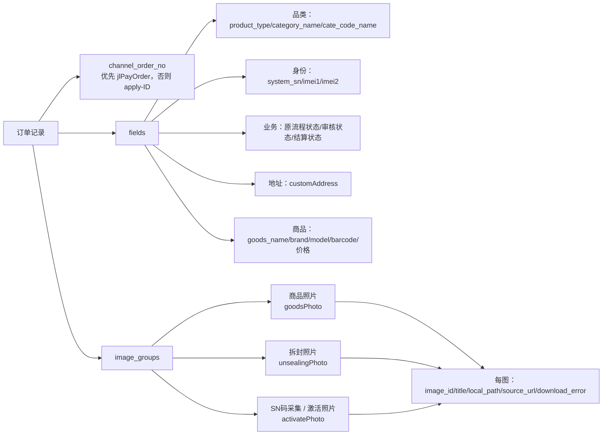

### 2.3 逐单核心输出

| 输出字段 | 含义 |
|---|---|
| `id` | 订单号 |
| `manual_flag` | 是否转人工，严格为“是/否” |
| `manual_reason_code` | 最终主原因码，仅一个 |
| `manual_reason_cn` | 中文原因 |
| `manual_reason` | 原因码与技术说明 |
| `source_flow_status` | 原本流程状态 |
| `system_sn` / `observed_sn` / `sn_match` | 系统 SN、模型读取 SN、精确比对结果 |
| `product_type_match` | 图片商品与订单品类是否一致 |
| `address_ok` | 家电地址是否满足粒度要求 |
| `product_photo_ok` | 商品照片是否合格 |
| `unboxing_photo_ok` | 拆封/安装证据是否合格 |
| `activation_photo_ok` | 激活/身份形式是否合格 |
| `activation_evidence_type` | 激活证据类型 |
| `image_risk` | 模型侧图片风险标记 |
| `elapsed_sec` | 该单总耗时 |
| `precheck_elapsed_sec` / `sn_elapsed_sec` / `compliance_elapsed_sec` | 分阶段耗时 |
| `model_calls` / `total_tokens` | 模型调用次数与 Token |
| `strategy` | 实际结束路径，如本地预检、SN 转人工、完整 hybrid |
| `photo_authenticity_*` | 逐图真实性结果、强证据数、人工复核数、服务异常等 |

## 3. 订单采集链路

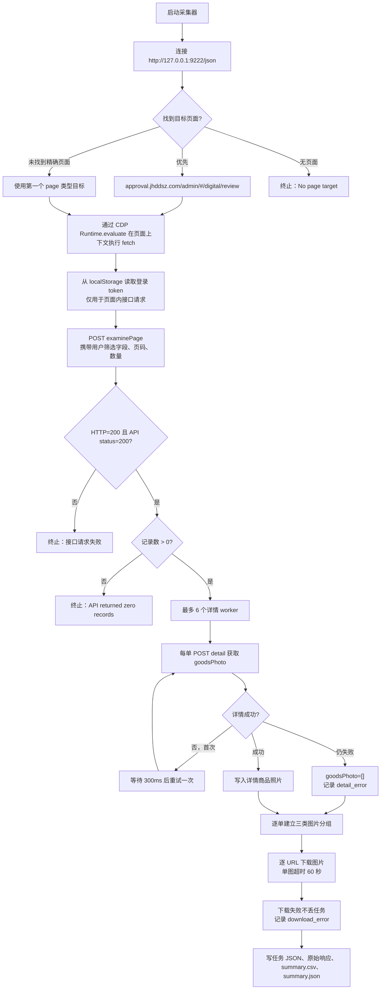

### 采集阶段关键约束

- 用户在页面设置的筛选条件不会自动从 DOM 猜测；调用脚本时应传入相同的状态、时间和其他字段。
- 列表接口返回订单主体；详情接口当前主要补充 `goodsPhoto`。
- 三类图片全部保留并下载，不再假定每单只有固定三张。
- 后续合规模型收到全部分组图片；SN 模型只收到激活/SN 分组。
- 下载失败会保留 URL 和错误文本，真实性本地引擎若需要文件但文件不存在会失败关闭。
- 原始响应和任务字段可能包含业务敏感信息，应限制本地目录权限和报表传播范围。

## 4. 批次启动、锁定与预检

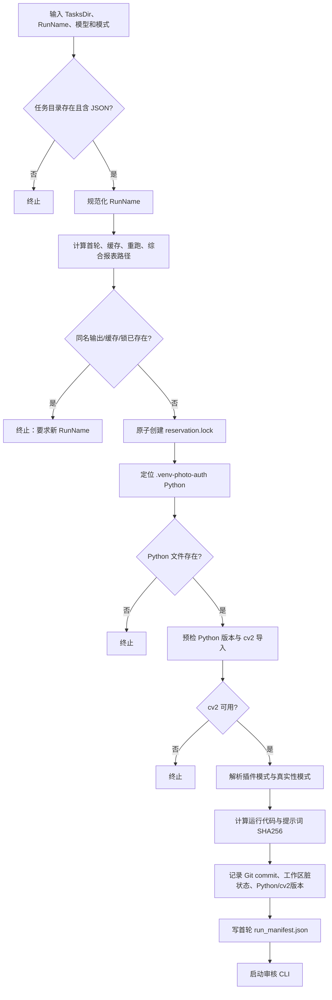

### 运行清单锁定的内容

首轮与网络重跑必须一致：

- 模型、模式、workers。
- 是否启用定向 SN 复核。
- SN 字符插件、SN 标签真实性插件、普通 3C 激活插件。
- 图片真实性模式、每单超时。
- Git commit、Python 路径与版本、cv2 版本、工作区脏状态。
- 运行代码文件 SHA256。
- 提示词文件 SHA256。

任何漂移都会拒绝合并，防止两轮使用不同规则后被当成同一批结果。

## 5. 单订单生产主链

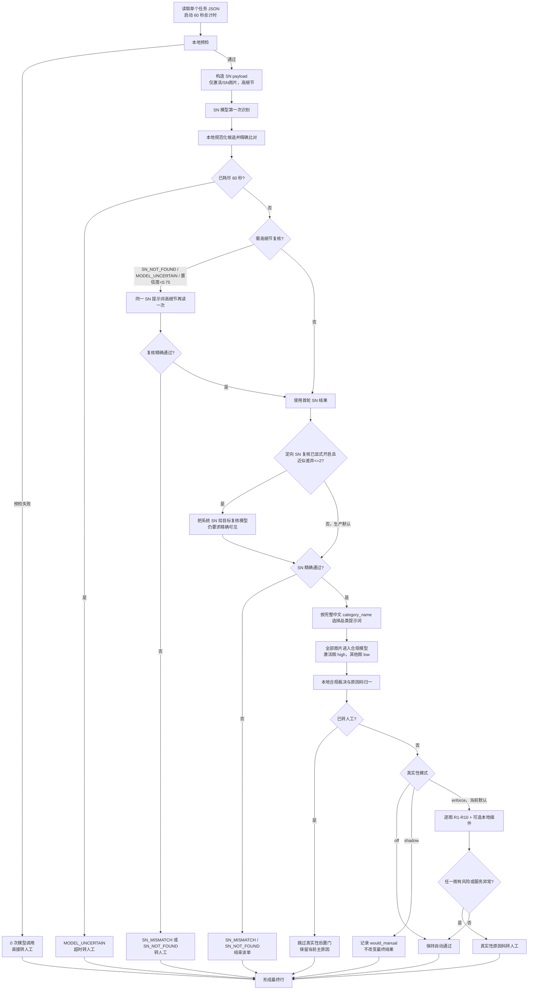

## 6. 本地预检

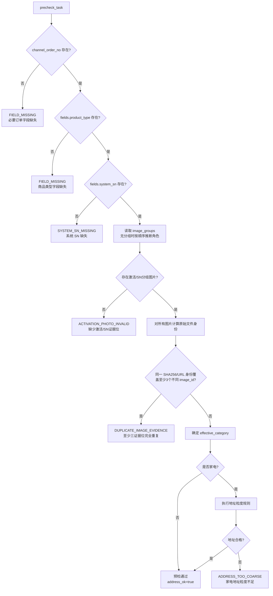

### 预检的重要事实

- 当前代码对“渠道订单号缺失”实际输出 `FIELD_MISSING`，虽然字典中保留了 `CHANNEL_ORDER_NO_MISSING`。
- 当前代码对“商品类型缺失”实际输出 `FIELD_MISSING`，虽然字典中保留了 `PRODUCT_TYPE_MISSING`。
- 预检不要求商品图和拆封图一定存在；缺失或证据不足由合规阶段判定具体无效码。
- 家电也必须先有系统 SN；不存在“家电完全不需要 SN”的入口例外。
- 三图重复是本地原始文件一致性规则，不依赖模型主观判断。

## 7. 品类确定与地址规则

### 7.1 品类确定

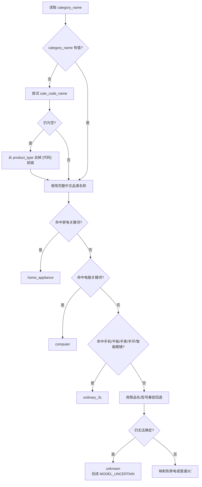

家电关键词包含冰箱、冰柜、冷柜、电视、空调、热水器、**热水炉**、壁挂炉、洗衣机、烘干机等。电脑匹配使用独立词边界，避免从型号字符串中的零散 `PC` 字符误判。

### 7.2 家电地址放行规则

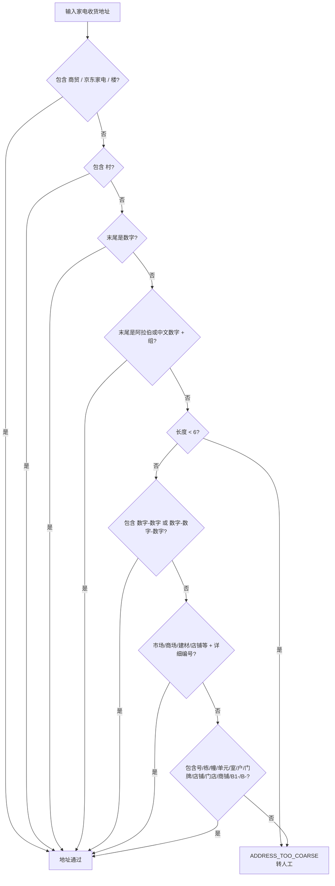

该规则只在 `effective_category=home_appliance` 时执行。

## 8. SN 识别与精确比对

### 8.1 SN 阶段模型职责

- 只查看激活/SN分组，不查看商品图和拆封图。
- 优先寻找设备屏幕 SN/序列号；其次设备机身；最后包装或条码标签。
- 不完整、不可读时不得猜测或补全。
- 输出结构化 `sn_candidates`，包含来源、字段类型、原文、规范化值、是否可读等。
- IMEI/EID 不是 SN 候选，不能拿来替代系统 SN 比对。
- SN 字符插件只加强 `V/Y、0/O、8/B、5/S、2/Z、6/G、1/I` 等字形观察；不赋予模糊放行权。

### 8.2 本地候选可信度判断

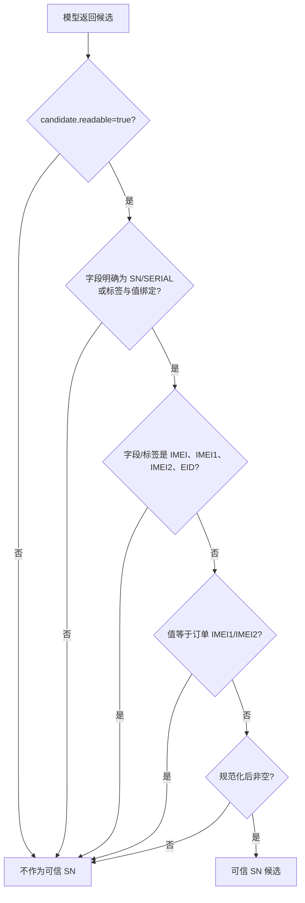

### 8.3 来源优先级与冲突规则

来源排序：

1. `DEVICE_SCREEN` / `SCREEN`：设备自身屏幕，最高优先级。
2. `DEVICE_BODY`：设备机身。
3. `PACKAGE_LABEL` / `BARCODE_TEXT`：包装和条码文字。

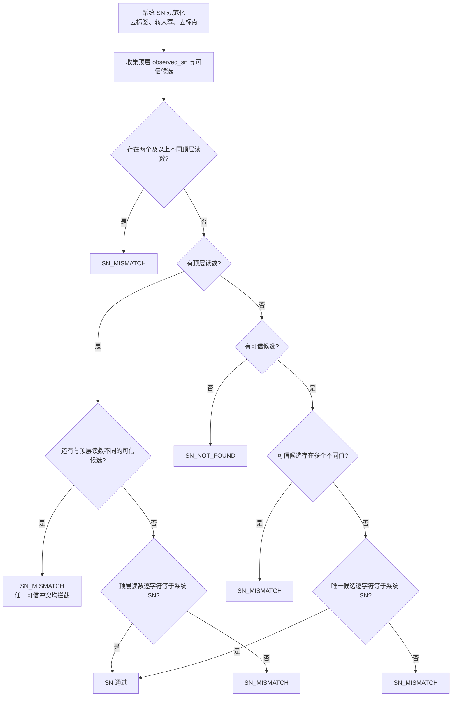

### 8.4 不可突破的 SN 原则

- `_system_sn_supported_by_visual_ambiguity()` 当前固定返回 `False`。
- 即使只差 `O/0、I/1、S/5、B/8`，也不能靠相似字符自动放行。
- 包装 SN 与系统一致，不能覆盖设备屏幕上一个可信但不一致的 SN。
- 任一可信冲突值会转 `SN_MISMATCH`。
- 只有精确字符一致才能进入图片合规阶段。
- 定向 SN 复核即使开启，也只能确认“系统 SN 是否精确可见”，不能确认相似字符串。

## 9. 图片合规公共规则与原因优先级

所有图片进入品类合规模型。模型负责结构化观察，本地代码负责原因码归一、字段一致性和最终强制门。

### 公共检查

1. 每张图是否为真实拍摄，是否有截图、相册图、外部屏幕翻拍、拼图、P图、SN/IMEI 区域篡改。
2. 发票编号旁是否有橘色感叹号。
3. 商品图片是否能证明商品本体或外包装。
4. 图片商品与订单完整中文品类是否明显不一致。
5. 拆封/安装证据是否满足对应品类规则。
6. 激活/身份形式是否满足对应品类规则。
7. 品类是否可确定、结构化输出是否完整、置信度是否足够。

### 本地主原因优先级

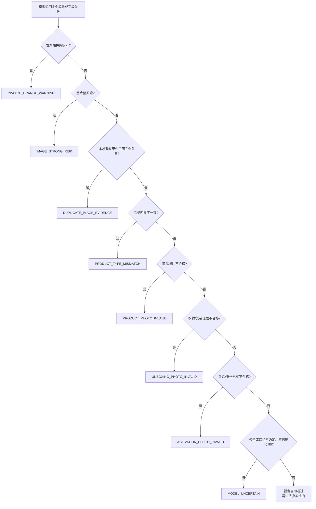

`SN_MISMATCH` 和 `SN_NOT_FOUND` 在生产 hybrid 主链中通常已在合规前结束订单；合规阶段出现的同名旧码会被归一，避免模型重新推翻前置 SN 裁决。

### 合规旧码归一

| 模型兼容码 | 归一后的当前含义 |
|---|---|
| `PHOTO_FAKE` | `IMAGE_STRONG_RISK`，图片明确强风险 |
| `SCREEN_PHOTO_OF_SCREEN` | `IMAGE_STRONG_RISK`，外部屏幕翻拍 |
| `SN_TAMPERED` | `IMAGE_STRONG_RISK`，SN 区域疑似篡改 |
| `IMAGE_TAMPERED` | `IMAGE_STRONG_RISK`，图片疑似处理 |
| `PHOTO_INVALID` | `MODEL_UNCERTAIN`，无法稳定确认 |
| `SN_MISSING_IN_ACTIVATION_PHOTO` | `ACTIVATION_PHOTO_INVALID` |
| 合规阶段 `SN_NOT_FOUND` | `ACTIVATION_PHOTO_INVALID` |
| 合规阶段 `SN_MISMATCH` | `MODEL_UNCERTAIN`，不能在后置阶段重做 SN 精确裁决 |
| `OK` / `PASS` / `SN_FOUND` / `SN_MATCH` | 不产生原因码 |

## 10. 家电审核

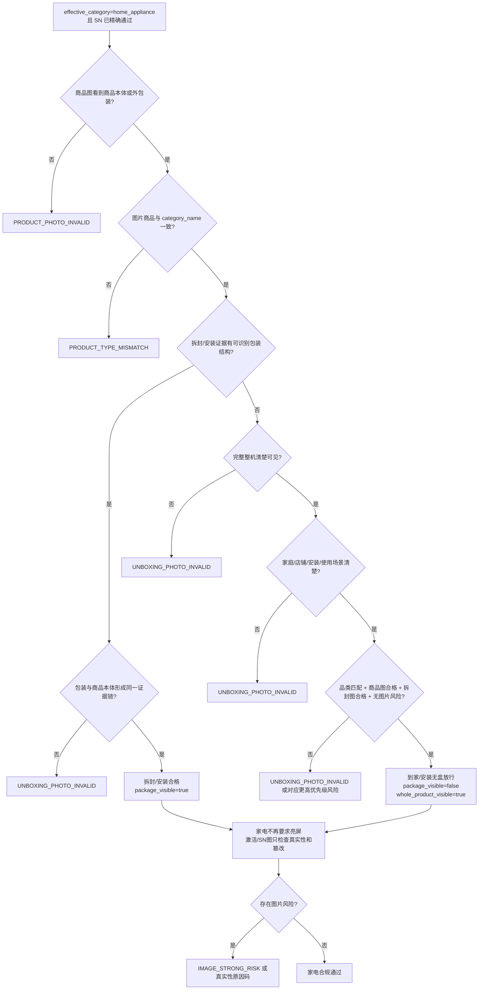

### 家电无盒放行的严格条件

必须同时满足：

- 前置 SN 已精确通过。
- 完整整机明确可见。
- 明确处于家庭、店铺、安装或实际使用场景。
- `product_type_match=match`。
- 商品照片和拆封/安装证据均合格。
- 不存在截图、翻拍、拼接、P图、篡改或真实性风险。

只有商品外观局部、铭牌、泡沫、胶带、保护膜、内部部件，或者环境模糊、无法证明已交付/拆封/安装时，不能使用“到家无盒”例外。

## 11. 普通 3C 审核

### 11.1 手机和平板

普通 3C 激活证据插件默认开启，并要求对**每一张激活图片**输出一条结构化观察：

- `image_id` 必须完整覆盖且不重复。
- `screen_on` 必须是布尔值。
- `screen_source` 只能是设备自身屏幕、外部显示/照片或未知。
- `identity_fields` 必须为数组。

```mermaid
flowchart TD
    A["手机/平板"] --> B{"商品图看到设备或外包装?"}
    B -->|"否"| X1["PRODUCT_PHOTO_INVALID"]
    B -->|"是"| C{"拆封图看到设备本体并与包装形成证据链?"}
    C -->|"否"| X2["UNBOXING_PHOTO_INVALID"]
    C -->|"是"| D{"每张激活图均有唯一结构化记录?"}
    D -->|"否"| X3["MODEL_UNCERTAIN"]
    D -->|"是"| E{"任一图为外部显示器/相册/照片载体?"}
    E -->|"是"| X4["IMAGE_STRONG_RISK"]
    E -->|"否"| F{"设备自身屏幕真实亮屏?"}
    F -->|"否"| X5["ACTIVATION_PHOTO_INVALID"]
    F -->|"是"| G{"至少一个完整可读身份字段?\nSN/序列号/IMEI1/IMEI2"]
    G -->|"否"| X6["ACTIVATION_PHOTO_INVALID"]
    G -->|"是"| H{"图片商品与订单品类一致?"}
    H -->|"否"| X7["PRODUCT_TYPE_MISMATCH"]
    H -->|"是"| PASS["普通3C合规通过"]
```

手机屏幕只有 IMEI 时，可以满足“激活身份形式”要求，但 **IMEI 仍不能当作 SN 与系统 SN 比对**；系统 SN 精确比对已在前置阶段完成。

### 11.2 智能手表/手环

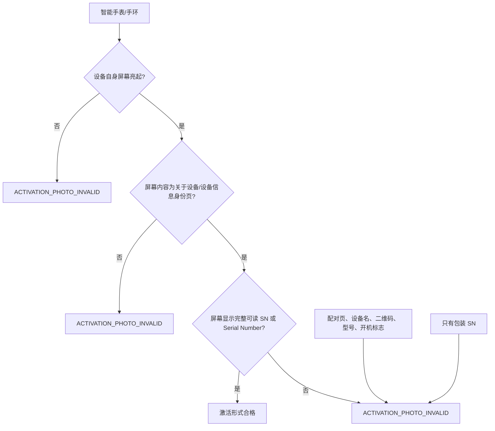

手表/手环不接受 IMEI 代替屏幕 SN，也不接受仅包装 SN。

## 12. 电脑审核

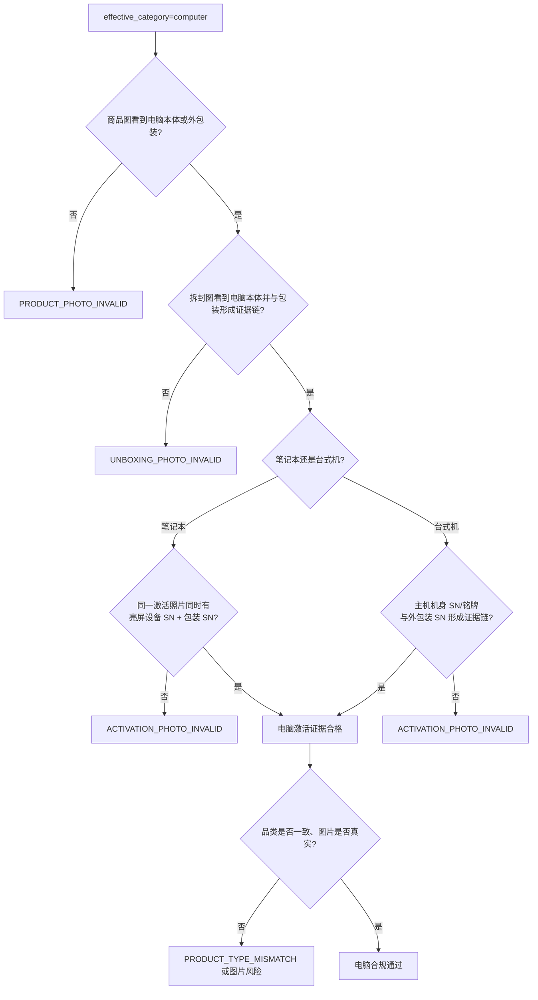

电脑不得套用普通 3C 的“屏幕仅 IMEI”规则，也不得套用家电“到家无盒后不要求亮屏”的规则。电脑自身 BIOS、系统信息页、设备信息页不因存在 UI 就自动判为翻拍。

## 13. 逐图真实性 R1-R10

### 13.1 模型只做逐图观察

每张输入图必须输出：

- 四边状态：场景连续、载体边界、突然截断、不可见、不确定。
- 屏幕归属：商品自身屏幕、外部屏幕、无屏幕、不确定。
- 强证据列表、弱证据列表和涉及区域。
- 不超过 160 字的客观观察。

必须一图一条、覆盖全部 `image_id`、不能重复、不能跨图拼证据。结构不完整会导致真实性服务失败并转人工。

### 13.2 强弱证据中文解释

| 技术标签 | 中文含义 | 证据级别 |
|---|---|---|
| `EXTERNAL_PHOTO_CARRIER` | 看到外部手机、显示器等承载完整照片的载体 | 强 |
| `PHOTO_VIEWER_UI` | 外部屏幕存在相册或图片查看器界面 | 强，但商品自身屏幕 UI 可豁免 |
| `PRINTED_PHOTO_CARRIER` | 纸张、相纸或印刷图片载体 | 强 |
| `NESTED_IMAGE_BOUNDARY` | 当前画面内存在另一张图片的完整边界 | 强 |
| `CROSS_OBJECT_MOIRE` | 同类摩尔纹跨至少两个非商品屏物理区域 | 强 |
| `EDGE_CUTOFF` | 边缘突然缺块、截断或不连续 | 弱 |
| `OUTER_PLANE_OPTICS` | 疑似外层平面的统一反光或光学痕迹 | 弱 |
| `PLANAR_APPEARANCE` | 整体缺乏景深，疑似平面二次成像 | 弱 |
| `LOCAL_MOIRE` | 只在单一区域出现摩尔纹 | 弱 |
| `UI_CANDIDATE` | 疑似但不明确的外部界面 | 弱 |

### 13.3 本地规则树

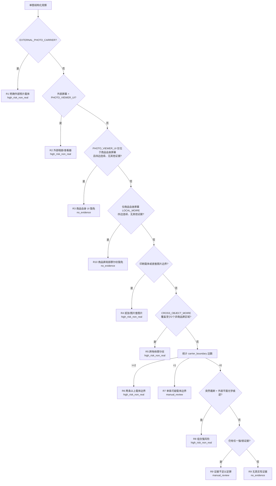

### 13.4 真实性模式

| 模式 | 执行情况 | 是否改变最终结果 |
|---|---|---|
| `off` | 不评估逐图真实性 | 否 |
| `shadow` | 评估并记录 `would_manual` | 否 |
| `enforce` | 评估并在命中时覆盖为人工 | 是，当前默认 |

真实性门只对前面仍为自动通过的订单执行；已经因 SN、地址、品类或照片证据转人工的订单不会再被真实性原因覆盖。

## 14. 可选本地图像插件与失败关闭

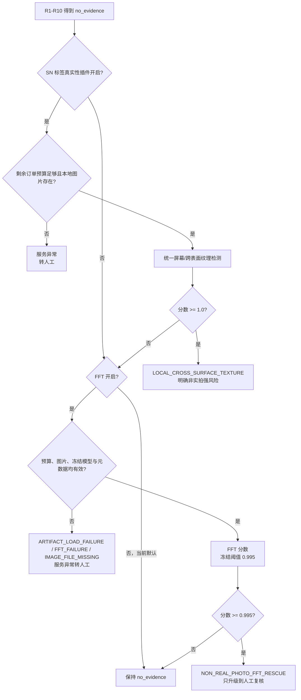

FFT 的唯一允许状态转换是 `no_evidence -> manual_review`，不能直接判强风险，也不能把已命中的风险降级为通过。

## 15. 超时、网络错误与单内重试

### 15.1 单订单 60 秒预算

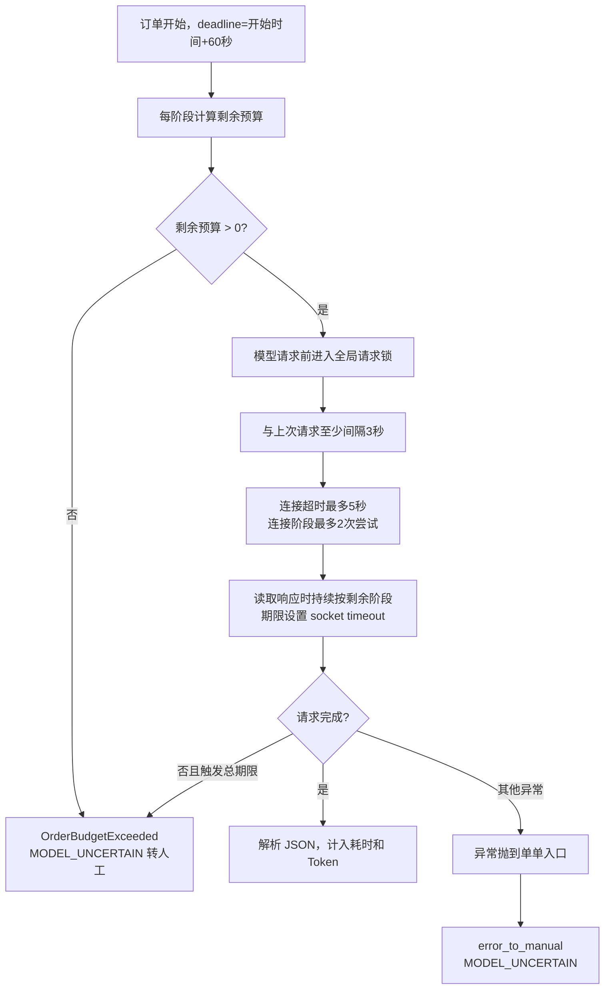

在生产 `hybrid` 中，各模型阶段调用 `retry_timeout_sec=0`，因此不会在同一阶段内部再做 15 秒模型重试；批次级网络失败重跑负责第二次完整尝试。

### 15.2 网络失败识别标记

以下文本会被识别为网络失败候选：

- `TimeoutError` / `timed out`。
- `OrderBudgetExceeded` / 超过每单 60 秒总期限。
- `ModelConnectionError` / `connect failed`。
- `WinError 10060`。
- `HTTP Error 500`。
- `RemoteDisconnected` / 远端关闭连接等。

只有被 `network_failure()` 识别的首轮订单，才允许进入批次级重跑。

## 16. 批次级网络失败重跑与合并

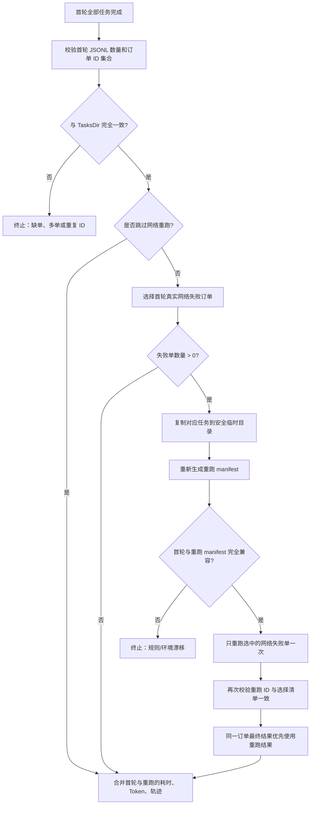

不允许重跑：

- 业务规则拦截单。
- SN 不一致或 SN 未找到单。
- 图片不合格、地址不合格、非实拍风险单。
- 不在首轮网络失败集合中的任意订单。

网络失败单的“有效耗时”单次按 60 秒封顶，原始耗时仍保留在 JSON 审计轨迹中。

## 17. 最终结果与报表生成

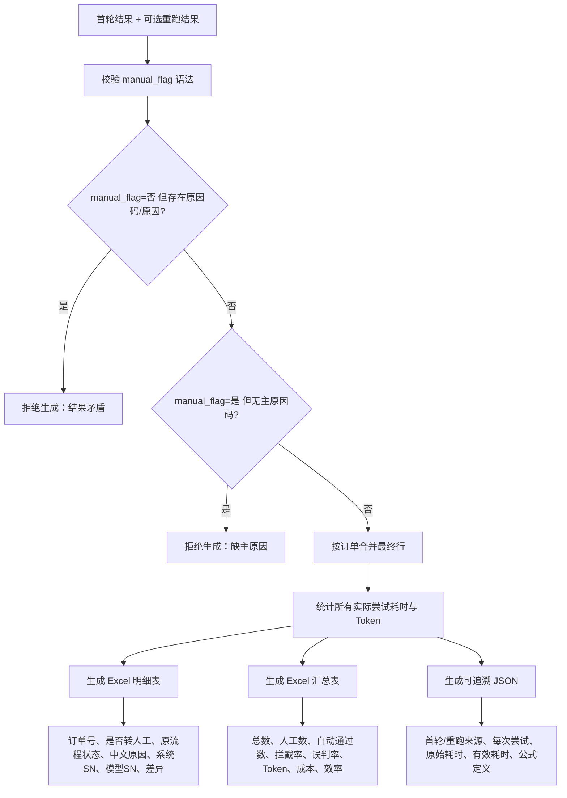

### Excel 明细表字段

1. 订单号。
2. 是否转人工。
3. 原始流程状态。
4. 转人工原因（标准中文）。
5. 系统 SN。
6. 模型识别 SN。
7. SN 比对状态。
8. SN 差异说明。

### Excel 汇总表指标

- 样本总数、转人工总数、自动通过总数。
- 原流程“未通过”订单的拦截数、分母和拦截率。
- 原流程“已通过”订单的误判数、分母和误判率。
- 输入 Token、输出 Token、Token 总消耗、预计成本。
- 有效审核总用时。
- 人工基准：550 单 / 7.5 小时。
- 人工预计用时、模型每小时审核量、效率倍数、效率提升率、预计节省人工时间。

## 18. 最终业务原因码中文总表

### 18.1 当前主链可直接产生

| 原因码 | 中文含义 | 主要触发位置 | 是否自动放行 |
|---|---|---|---|
| `INVOICE_ORANGE_WARNING` | 发票编号旁出现橘色感叹号，需人工复核 | 图片合规 | 否 |
| `SN_MISMATCH` | 系统 SN 与照片中的可信 SN 不一致 | SN 本地精确裁决 | 否 |
| `SN_NOT_FOUND` | 未读取到完整、明确、可信的 SN | SN 本地精确裁决 | 否 |
| `PRODUCT_PHOTO_INVALID` | 商品照片不能证明商品本体或有效外包装 | 分品类图片合规 | 否 |
| `PRODUCT_TYPE_MISMATCH` | 图片商品品类与订单完整中文品类明显不一致 | 分品类图片合规 | 否 |
| `UNBOXING_PHOTO_INVALID` | 拆封、包装链或安装/到家证据不足 | 分品类图片合规 | 否 |
| `ACTIVATION_PHOTO_INVALID` | 激活/SN身份形式不符合该品类要求 | 预检或分品类合规 | 否 |
| `IMAGE_STRONG_RISK` | 图片存在明确截图、翻拍、拼接、P图或篡改风险 | 合规模型 + 本地门 | 否 |
| `DUPLICATE_IMAGE_EVIDENCE` | 至少三个不同证据位使用完全相同原始图片 | 本地 SHA256/URL 身份检查 | 否 |
| `MODEL_UNCERTAIN` | 模型不确定、输出结构异常、低置信度、异常或超时 | 各阶段失败关闭 | 否 |
| `ADDRESS_TOO_COARSE` | 家电收货地址粒度不足 | 本地预检 | 否 |
| `SYSTEM_SN_MISSING` | 系统 SN 字段缺失 | 本地预检 | 否 |
| `FIELD_MISSING` | 必要订单字段缺失 | 本地预检 | 否 |

### 18.2 图片真实性最终原因码

| 原因码 | 中文含义 | 触发条件 |
|---|---|---|
| `NON_REAL_PHOTO_STRONG_RISK` | 明确非实拍强风险 | 任一图为 `high_risk_non_real` |
| `NON_REAL_PHOTO_REVIEW` | 图片真实性存在弱证据，需人工复核 | 任一图为 `manual_review` 且非 FFT/服务异常 |
| `NON_REAL_PHOTO_FFT_RESCUE` | FFT 补充模型命中，需人工复核 | FFT 分数达到冻结阈值 0.995 |
| `PHOTO_AUTHENTICITY_SERVICE_FAILURE` | 图片真实性服务异常，按失败关闭转人工 | 结构、预算、文件、模型或本地处理异常 |

### 18.3 保留或兼容原因码

| 原因码 | 中文含义 | 当前状态 |
|---|---|---|
| `CHANNEL_ORDER_NO_MISSING` | 渠道订单号缺失 | 字典保留；当前预检实际使用 `FIELD_MISSING` |
| `PRODUCT_TYPE_MISSING` | 商品类型缺失 | 字典保留；当前预检实际使用 `FIELD_MISSING` |
| `IMAGE_MISSING` | 审核图片缺失 | 字典保留；激活组缺失当前使用 `ACTIVATION_PHOTO_INVALID`，本地文件缺失可能转真实性服务异常 |
| `SN_TRUNCATED_OBSCURED` | SN 不完整或被遮挡 | 报表兼容显示；主链通常归入 `SN_NOT_FOUND` |
| `DUPLICATE_IMAGE` | 图片重复、证据不足 | 兼容旧码；当前正式码为 `DUPLICATE_IMAGE_EVIDENCE` |
| `ARTIFACT_LOAD_FAILURE` | 本地模型文件加载失败 | 报表兼容；真实性最终主码为服务异常 |
| `FFT_FAILURE` | FFT 推理失败 | 报表兼容；真实性最终主码为服务异常 |

## 19. 图片真实性技术标签中文总表

| 技术标签 | 中文解释 | 对订单最终影响 |
|---|---|---|
| `ORDER_BUDGET_EXHAUSTED` | 真实性处理前订单 60 秒预算已耗尽 | 服务异常，转人工 |
| `IMAGE_FILE_MISSING` | 需要本地图片时文件不存在 | 服务异常，转人工 |
| `SN_LABEL_AUTH_LOCAL_FAILURE` | SN 标签本地纹理检测失败 | 服务异常，转人工 |
| `LOCAL_CROSS_SURFACE_TEXTURE` | 本地检测到跨表面统一纹理，疑似二次成像 | 明确非实拍强风险 |
| `ARTIFACT_LOAD_FAILURE` | 冻结 FFT 模型或元数据无法加载/校验 | 服务异常，转人工 |
| `FFT_FAILURE` | FFT 特征或推理连续失败 | 服务异常，转人工 |
| `FFT_RESCUE` | FFT 从“无证据”补充命中为人工复核 | `NON_REAL_PHOTO_FFT_RESCUE` |
| `high_risk_non_real` | 单图明确非实拍高风险 | `NON_REAL_PHOTO_STRONG_RISK` |
| `manual_review` | 单图存在弱证据或技术异常 | 人工复核 |
| `no_evidence` | 当前规则未发现非实拍证据 | 不因真实性拦截 |

## 20. 生产主链、插件与兼容路径

```mermaid
flowchart LR
    A["run_guobu_model_audit.py"] -->|"旧文件名兼容"| H["run_guobu_model_audit_v2.py"]
    H --> P["hybrid\n当前生产默认"]
    H --> V["v2\n分阶段但不启用 hybrid 真实性主线"]
    H --> S["sn_only\n仅 SN 对比测试"]
    H --> F["fast\n兼容模式，旧一次性提示词已声明废弃"]
    P --> C1["SN 字符插件 off/on/v2\n默认 off"]
    P --> C2["定向 SN 复核\n批次默认关闭"]
    P --> C3["普通3C激活插件\n默认 on"]
    P --> C4["SN标签真实性插件\n默认 off"]
    P --> C5["真实性 off/shadow/enforce\n默认 enforce"]
    C5 --> C6["FFT\n默认 false"]
```

### 状态解释

- **生产主链**：`run_guobu_audit_batch.ps1 -> run_guobu_model_audit_v2.py --mode hybrid`。
- **旧入口兼容**：`run_guobu_model_audit.py` 不再执行旧的一次性审核，只转发到 v2 CLI。
- **fast**：仍可被 CLI 选择，但其旧提示词明确标记为废弃，不应作为业务规则来源。
- **v2**：保留分阶段路径，当前批次默认不使用。
- **sn_only**：用于 SN 专项测试，不执行完整图片合规。
- **可选插件**：开关会进入运行 manifest；首轮与重跑不一致时禁止合并。

## 21. 最终自动通过必须同时满足

```mermaid
flowchart TD
    A["订单候选自动通过"] --> B{"必要字段和激活分组完整?"}
    B -->|"否"| NO["转人工"]
    B -->|"是"| C{"家电地址合格或非家电?"}
    C -->|"否"| NO
    C -->|"是"| D{"不存在至少三图完全重复?"}
    D -->|"否"| NO
    D -->|"是"| E{"SN 存在且逐字符精确一致\n无任何可信冲突?"}
    E -->|"否"| NO
    E -->|"是"| F{"品类明确且图片商品一致?"}
    F -->|"否"| NO
    F -->|"是"| G{"商品照片合格?"}
    G -->|"否"| NO
    G -->|"是"| H{"拆封/安装证据满足对应品类?"}
    H -->|"否"| NO
    H -->|"是"| I{"激活/身份形式满足对应品类?"}
    I -->|"否"| NO
    I -->|"是"| J{"无发票警告、图片强风险和低置信度?"}
    J -->|"否"| NO
    J -->|"是"| K{"逐图真实性无强证据、弱证据和服务异常?"}
    K -->|"否"| NO
    K -->|"是"| YES["自动通过"]
```

核心原则：**非实拍不放行优先；不确定不放行；SN 不做模糊放行；模型输出必须经过本地确定性规则约束。**

## 22. 源代码定位

| 链路 | 主要文件 | 关键职责 |
|---|---|---|
| 采集 | `tools/guobu_one_click_collect.js` | 一键 probe 总数、读取登录态、调用接口采集、详情补充、图片下载、任务生成 |
| 批次编排 | `tools/run_guobu_audit_batch.ps1` | 默认参数、环境预检、运行锁、manifest、首轮、重跑、报表 |
| 审核主链 | `tools/run_guobu_model_audit_v2.py` | SN、品类合规、本地裁决、超时、输出字段 |
| 真实性 | `tools/photo_authenticity_mainline.py` | 逐图结构校验、R1-R10、本地插件、失败关闭 |
| 批次契约 | `tools/guobu_audit_contract.py` | 首轮 ID 完整性、manifest 兼容、网络失败识别 |
| 任务选择 | `tools/select_guobu_tasks.py` | 只选择可重跑的真实网络失败任务 |
| 综合报表 | `tools/guobu_audit_report.py` | 首轮/重跑合并、Token/耗时核算、Excel/JSON |
| 兼容品类分类 | `modules/category_classifier.py` | 旧模块品类兼容回退 |
| SN 字符插件 | `prompts/sn_similar_char_review.txt`、`prompts/sn_similar_char_review_v2.txt` | 视觉易混字符识别增强，不改变精确比较 |
| 3C 激活插件 | `prompts/digital_activation_evidence_review.txt` | 手机/平板/手表逐激活图身份结构化观察 |
| SN 标签真实性插件 | `prompts/sn_label_authenticity_review.txt` | 可选 SN/条码标签真实性观察 |

## 23. 审计边界与风险提示

- 当前链路完成的是“采集、模型审核、人工标记建议、报表输出”，并未在本文中描述或启用自动点击后台通过按钮、自动修改平台状态的写回接口。
- 采集任务和原始响应可能包含地址、订单、设备标识等业务数据；模型请求会发送审核所需字段和图片。部署时应采用最小字段、最小权限、受控存储、日志脱敏和密钥隔离。
- API 密钥只能通过环境变量传入，不能写入任务、报表、流程图或版本库。
- `Workers>1` 虽然 CLI 支持，但全局 3 秒请求间隔和 60 秒单单预算会相互影响；当前生产默认 1 worker 是文档所描述的稳定口径。
- 本文不把历史测试能力等同于当前生产能力；任何插件切换、提示词变化、模型变化都应形成新 RunName 和新 manifest 后重新验证。
